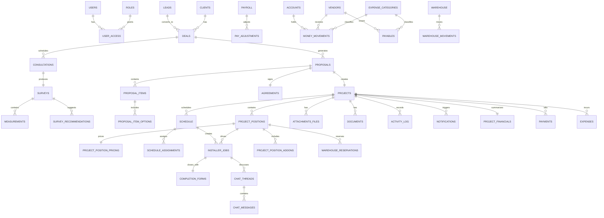
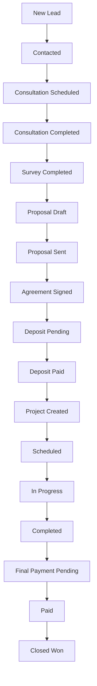
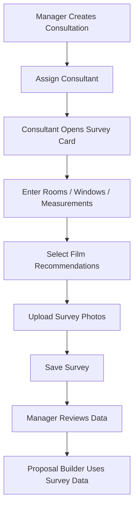
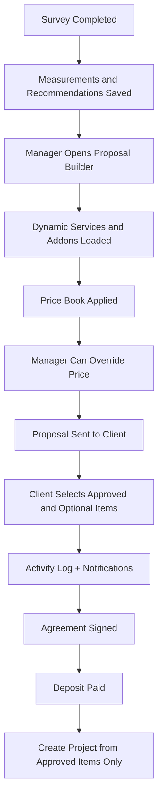
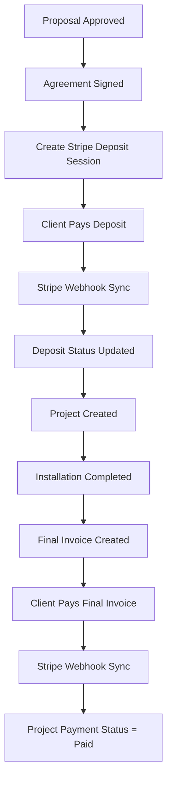
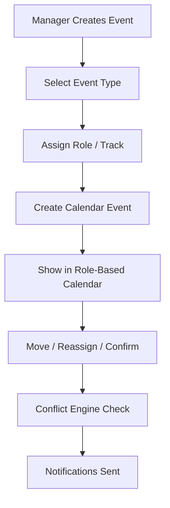
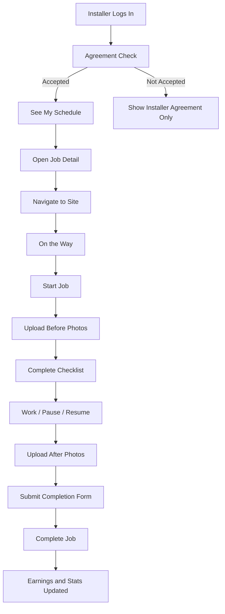
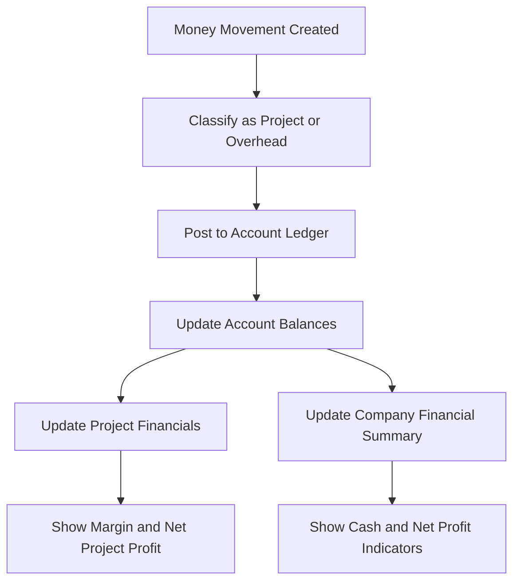
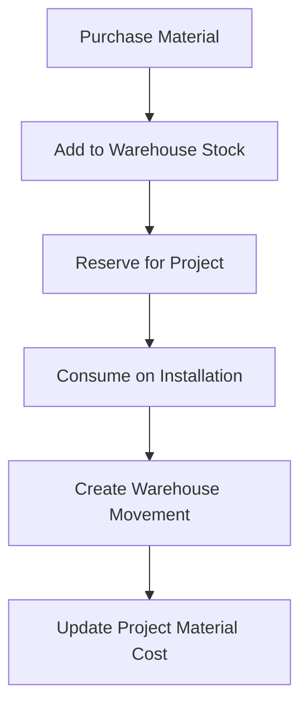
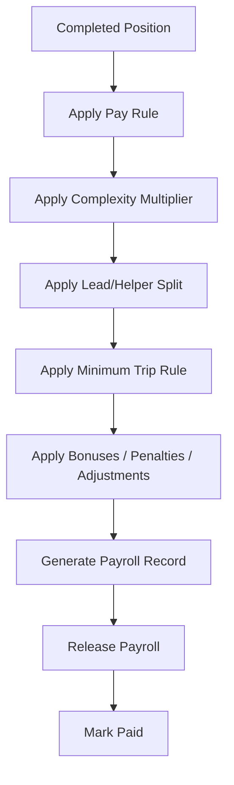

# ROLANPRO V1 Core Architecture

## Scope

This document is the final V1 architecture baseline for `ROLANPRO SYSTEM`.

Core rules:

- Interface language: `Russian`
- Internal CRM / ERP / Installer App UI uses `Russian`, while client-facing proposals, agreements, invoices, completion forms, warranty documents, and emails use `English`
- Architecture: `Web CRM / Installer App -> Backend API -> Database -> File Storage -> Stripe -> Gmail API`
- Do not use `Google Sheets`, `Google Drive`, or `Google Calendar` as the core logic layer
- Dynamic service logic must come from reference tables and configuration
- `Project` is the operational container
- `Project_Position` is the service unit
- All calculations live in backend services, not in the frontend
- Reference-driven labels must come from translation fields, not hardcoded text

## 1. Final Modules List

| Module | Purpose | V1 Status |
|---|---|---|
| `CRM` | leads, clients, deals, pipeline, follow-up | V1 |
| `Survey` | consultations, measurements, room/window data, film recommendations, photos | V1 |
| `Proposal` | proposal builder, client selection flow, agreement, deposit start | V1 |
| `Projects` | project container, positions, operations, files, activity | V1 |
| `Dispatch / Scheduling` | unified calendar, scheduling board, crew planning, conflicts | V1 |
| `Installer App` | schedule, jobs, checklist, completion, earnings, stats | V1 |
| `Warehouse` | materials, reservations, movements, project material cost input | V1 basic |
| `Payroll` | installer payout logic by position, pay rules, adjustments | V1 basic |
| `Finance` | accounts, money movements, payables, overhead, project financial performance, company cash and profit indicators | V1 |
| `ERP Dashboard` | owner and manager overview, KPI, alerts, operations summary | V1 |
| `Settings / Reference Tables` | controlled business configuration | V1 |
| `Platform Services` | auth, notifications, email, files, Stripe, Gmail API | V1 |

## 2. Final Core Entities

### Sales and CRM

- `users`
- `roles`
- `user_access`
- `leads`
- `clients`
- `deals`
- `tasks`
- `follow_ups`

### Consultations and Survey

- `consultations`
- `surveys`
- `measurements`
- `survey_recommendations`

### Proposal and Agreement

- `proposals`
- `proposal_items`
- `proposal_item_options`
- `proposal_events`
- `agreements`

### Projects and Operations

- `projects`
- `project_positions`
- `project_position_pricing`
- `project_position_addons`
- `schedule`
- `schedule_assignments`
- `calendar_events`
- `installer_jobs`
- `completion_forms`

### Files and Communication

- `attachments_files`
- `documents`
- `activity_log`
- `notifications`
- `email_actions`
- `email_log`
- `chat_threads`
- `chat_messages`

### Finance and Payments

- `vendors`
- `accounts`
- `money_movements`
- `expense_categories`
- `payables`
- `project_financials`
- `company_financial_summary`
- `payments`
- `payment_events`
- `expenses`
- `payroll`
- `pay_adjustments`

### Warehouse

- `warehouse_items`
- `warehouse`
- `warehouse_reservations`
- `warehouse_movements`

### Dynamic Service Engine and Settings

- `service_types`
- `service_field_config`
- `service_addons`
- `film_catalog`
- `block_types`
- `control_types`
- `event_types`
- `event_tracks`
- `project_statuses`
- `position_statuses`
- `payment_statuses`
- `schedule_statuses`
- `pipeline_statuses`
- `complexity_levels`
- `price_book_items`
- `pay_rules`
- `split_rules`
- `minimum_trip_rules`
- `checklist_templates`
- `document_types`
- `email_templates`
- `notification_types`
- `expense_categories`
- `problem_types`
- `cities`
- `service_areas`
- `crews`

## 3. Reference Tables

| Table | Core fields | Used by |
|---|---|---|
| `service_types` | `service_type_id`, `name_ru`, `name_en`, `service_code`, `unit_type`, `active` | `project_positions`, `proposal_items`, `service_field_config`, `service_addons` |
| `service_field_config` | `field_config_id`, `service_type_id`, `field_key`, `field_label`, `input_type`, `dropdown_source`, `is_required`, `sort_order` | dynamic position form, proposal item form |
| `service_addons` | `service_addon_id`, `service_type_id`, `name_ru`, `name_en`, `addon_code`, `unit_type`, `default_price` | `project_position_addons`, `proposal_item_options` |
| `film_catalog` | `film_id`, `category_name_ru`, `category_name_en`, `brand_name_ru`, `brand_name_en`, `model_name_ru`, `model_name_en`, `thickness`, `unit`, `active` | surveys, proposal items, project positions, warehouse |
| `warehouse_items` | `warehouse_item_id`, `item_name_ru`, `item_name_en`, `category_name_ru`, `category_name_en`, `brand`, `model`, `unit`, `active` | `project_positions`, warehouse stock, warehouse movements |
| `block_types` | `block_type_id`, `name`, `code`, `active` | smart film positions |
| `control_types` | `control_type_id`, `name`, `code`, `active` | smart film, electrical scope |
| `roles` | `role_id`, `role_name`, `role_code`, `active` | `users`, `user_access` |
| `crews` | `crew_id`, `crew_name`, `lead_employee_id`, `active` | `schedule_assignments`, dispatch filters |
| `project_statuses` | `project_status_id`, `name_ru`, `name_en`, `status_code`, `color_token` | `projects` |
| `position_statuses` | `position_status_id`, `status_name`, `status_code`, `color_token` | `project_positions` |
| `payment_statuses` | `payment_status_id`, `status_name`, `status_code`, `color_token` | `projects`, `payments`, `proposals` |
| `schedule_statuses` | `schedule_status_id`, `status_name`, `status_code`, `color_token` | `schedule`, `calendar_events` |
| `pipeline_statuses` | `pipeline_status_id`, `status_name`, `status_code`, `sort_order` | `leads`, `deals` |
| `complexity_levels` | `complexity_level_id`, `level_name`, `multiplier`, `color_token` | surveys, projects, positions, pay rules |
| `event_types` | `event_type_id`, `name_ru`, `name_en`, `code`, `color_token` | `calendar_events` |
| `event_tracks` | `event_track_id`, `name`, `code`, `color_token` | calendar lanes and filters |
| `document_types` | `document_type_id`, `name_ru`, `name_en`, `code`, `requires_signature` | `documents` |
| `notification_types` | `notification_type_id`, `name`, `code`, `default_channel` | `notifications` |
| `email_templates` | `email_template_id`, `template_key`, `subject_template`, `body_template`, `language_scope=en` | `email_actions`, Gmail sends |
| `checklist_templates` | `checklist_template_id`, `name`, `service_type_id`, `items_json` | `installer_jobs`, `completion_forms` |
| `price_book_items` | `price_book_item_id`, `name_ru`, `name_en`, `service_type_id`, `film_id`, `base_price`, `min_price`, `unit_type`, `active` | proposals, positions, pricing engine |
| `pay_rules` | `pay_rule_id`, `service_type_id`, `role_type`, `rate`, `complexity_multiplier`, `minimum_trip`, `split_mode` | payroll engine |
| `split_rules` | `split_rule_id`, `service_type_id`, `lead_percent`, `helper_percent`, `active` | payroll split logic |
| `minimum_trip_rules` | `minimum_trip_rule_id`, `service_type_id`, `amount`, `active` | payroll minimum trip logic |
| `expense_categories` | `category_id`, `name_ru`, `name_en`, `parent_type`, `parent_category_id`, `active` | `money_movements`, `payables`, `expenses` |
| `problem_types` | `problem_type_id`, `name`, `severity`, `active` | `installer_jobs`, `projects`, notifications |
| `cities` | `city_id`, `city_name`, `state_code`, `active` | leads, clients, projects |
| `service_areas` | `service_area_id`, `name`, `city_id`, `active` | scheduling, sales coverage |

Localization rule for reference data:

- Internal screens render Russian labels from translation fields such as `name_ru`.
- Client-facing documents and emails render English labels from translation fields such as `name_en`.
- `film_catalog` and `warehouse_items` should use domain-specific bilingual fields where one generic `name_ru` / `name_en` pair is not enough.
- Reference labels must not be hardcoded in frontend components, PDF templates, or email templates.

## 4. Role Permissions Matrix

Legend:

- `V` = view
- `E` = edit
- `Own` = only own assigned records
- `-` = no access

| Module / Screen | Owner | Manager | Consultant / Surveyor | Installer |
|---|---|---|---|---|
| `Dashboard / KPI` | `V` | `V` | `-` | `-` |
| `Leads / Pipeline` | `V` | `E` | `-` | `-` |
| `Clients` | `V` | `E` | `V Own` | `-` |
| `Deals / Opportunities` | `V` | `E` | `-` | `-` |
| `Consultations` | `V` | `E` | `V/E Own` | `-` |
| `Survey / Measurements` | `V` | `E` | `V/E Own` | `-` |
| `Proposal Builder` | `V` | `E` | `V` | `-` |
| `Agreement / Deposit` | `V` | `E` | `-` | `-` |
| `Projects List` | `V` | `E` | `V Own assigned context` | `-` |
| `Project Card` | `V` | `E` | `V survey-related sections` | `-` |
| `Unified Calendar` | `V` | `E` | `V Own` | `V Own` |
| `Scheduling / Dispatch` | `V` | `E` | `-` | `-` |
| `Installer App` | `-` | `-` | `-` | `V/E Own` |
| `Files / Photos` | `V` | `E` | `V/E Own survey files` | `V/E Own job files` |
| `Documents` | `V` | `E` | `V limited` | `-` |
| `Payments / Stripe` | `V` | `E` | `-` | `V Own earnings only` |
| `Warehouse` | `V` | `E` | `-` | `V limited if assigned` |
| `Payroll` | `V` | `E limited` | `-` | `V Own only` |
| `Finance / Money Tracker` | `V` | `E` | `-` | `-` |
| `Owner ERP Dashboard` | `V` | `-` | `-` | `-` |
| `Manager Sales Dashboard` | `V` | `E` | `-` | `-` |
| `Pipeline Board` | `V` | `E` | `-` | `-` |
| `Settings / Reference Tables` | `V` | `E` | `-` | `-` |
| `Notifications` | `V` | `E` | `V Own` | `V Own` |
| `Email Logs` | `V` | `E` | `V limited` | `-` |

## 5. Screen Specs

### `Dashboard`

- Purpose: owner and manager overview
- Blocks: KPI row, pipeline summary, upcoming consultations, today's installs, unassigned jobs, overdue jobs, payment alerts, finance indicators, live notifications
- Roles: owner, manager
- Actions: open lead, open project, open scheduling board, open payment alert

Financial dashboard indicators:

- `Cash on Hand`
- `Bank Balance`
- `Stripe Pending`
- `Tax Reserve`
- `Available to Withdraw`
- `Revenue This Month`
- `Expenses This Month`
- `Overhead This Month`
- `Payroll This Month`
- `Gross Profit`
- `Margin %`
- `Net Profit`
- `Outstanding Invoices`

### `Manager Sales Dashboard`

- Purpose: manage daily sales and pipeline execution
- Blocks: `New Leads`, `Follow Ups Today`, `Consultations Today`, `Proposals Pending`, `Deposits Pending`, `Projects Waiting Schedule`, `Projects In Progress`, `Final Payments Pending`
- KPIs: `Leads`, `Calls`, `Consultations Scheduled`, `Consultations Completed`, `Proposals Sent`, `Deals Won`, `Deals Lost`, `Revenue`, `Average Deal Size`, `Closing Rate`, `Lead -> Consultation %`, `Consultation -> Proposal %`, `Proposal -> Deal %`, `Revenue per Manager`
- Roles: owner view, manager edit
- Actions: open lead, create follow-up, schedule consultation, send proposal, chase deposit

### `Pipeline Board`

- Purpose: provide Kanban control over the sales funnel
- Blocks: stage columns, deal cards, owner/manager filters, follow-up markers, deal value summaries
- Pipeline statuses: `New Lead`, `Contacted`, `Consultation Scheduled`, `Consultation Completed`, `Survey Completed`, `Proposal Draft`, `Proposal Sent`, `Proposal Updated by Client`, `Agreement Signed`, `Deposit Pending`, `Deposit Paid`, `Project Created`, `Scheduled`, `In Progress`, `Completed`, `Final Payment Pending`, `Paid`, `Closed Won`, `Closed Lost`, `Warranty / Service`
- Roles: owner view, manager edit
- Actions: drag-and-drop between stages, open deal, assign follow-up, create consultation, create proposal

### `Owner ERP Dashboard`

- Purpose: show company-wide operational and financial performance
- Blocks: money now, period performance, profitability, project finance alerts, crew performance, growth KPIs
- Roles: owner
- Actions: open finance module, open low-margin project, open unpaid project, open crew report

### `Leads / Pipeline`

- Purpose: manage sales funnel from lead to project
- Blocks: pipeline stages, lead table, follow-up panel, quick actions
- Roles: owner view, manager edit
- Actions: create lead, move stage, schedule consultation, create proposal

### `Consultations Calendar`

- Purpose: plan consultations, surveys, re-measures
- Blocks: day/week/month calendar, consultant filters, unassigned lane, event detail drawer
- Roles: owner view, manager edit, consultant own view
- Actions: assign consultant, move event, create survey card, mark completed

### `Survey Card`

- Purpose: capture measurements and recommendations on site
- Blocks: client info, address, room/zone list, measurement grid, film recommendation, notes, survey photos
- Roles: manager, consultant
- Actions: add room, add measurement, upload photos, select film, save recommendations, convert to proposal inputs

Important rule:

- survey data is entered once and then reused in `proposal`, `project`, `scheduling`, `files`, and `finance`

### `Proposal Builder`

- Purpose: build proposal from approved measurements and selected services
- Blocks: proposal header, proposal items, optional items, service cards, totals, pricing summary, agreement action
- Roles: owner view, manager edit
- Actions: add item, remove item, price override, below-min warning review, send proposal, generate agreement

Pricing rules:

- show `base_price`
- show `min_price`
- allow manager to set `actual_price`
- show variance from base and minimum
- show warning and approval requirement if below minimum

### `Project Card`

- Purpose: central operations screen for approved work
- Blocks: header, overview, positions, crew assignment, schedule, files, documents, activity log, payment status, notifications, email actions
- Roles: owner view, manager edit
- Actions: add position, assign crew, upload files, update status, trigger email, review payments

### `Warehouse`

- Purpose: track stock, reservations, consumption, and project material cost
- Blocks: inventory list, stock balances, reservations, consumption history, low stock alerts
- Roles: owner view, manager edit
- Actions: add stock, reserve material, consume material, return material, adjust quantity

### `Payroll`

- Purpose: compute installer pay by position and show payout periods
- Blocks: payroll periods, installer payout table, adjustments, split logic, minimum trip rules
- Roles: owner view, manager limited edit
- Actions: review payout, apply manual adjustment, release payroll, mark payroll paid

### `Scheduling Board`

- Purpose: dispatch installs and service work
- Blocks: day/week grid, crew columns, installer load, unassigned lane, conflict panel, materials badges
- Roles: owner view, manager edit
- Actions: drag-and-drop, assign crew, move time, detect conflicts, flag material issue

### `Installer App`

- Purpose: field execution for installers
- Blocks: my schedule, my jobs, job detail, photos, checklist, completion form, earnings, stats, notifications, optional chat
- Roles: installer
- Actions: on the way, start, pause, resume, complete, report problem, upload photos, submit completion form

### `Clients`

- Purpose: customer master view
- Blocks: client list, contact panel, recent proposals, recent projects, payment history summary
- Roles: owner view, manager edit, consultant limited view
- Actions: edit contact, open consultation, open proposal, open project

### `Settings`

- Purpose: manage all controlled dropdowns and templates
- Blocks: reference table navigator, editable table, preview panels, activation toggles
- Roles: manager edit, owner view
- Actions: add service type, edit field config, update template, change pricing, update pay rules

### `Finance / Money Tracker`

- Purpose: track company cash, project-linked money flows, overhead, payables, and financial performance
- Blocks: accounts balances, money movements ledger, payables list, project financials panel, company financial summary, outstanding invoices
- Roles: owner view, manager edit
- Actions: add money movement, classify expense, link movement to project, create payable, mark payable paid, review project and company financials

## 6. Database Schema

### Identity and Access

| Table | Key fields |
|---|---|
| `users` | `user_id PK`, `email`, `password_hash`, `employee_id FK`, `is_active`, `last_login_at` |
| `roles` | `role_id PK`, `role_name`, `role_code`, `active` |
| `user_access` | `user_access_id PK`, `user_id FK`, `role_id FK`, `scope_json`, `status` |
| `employees` | `employee_id PK`, `name`, `role_id FK`, `crew_id FK nullable`, `phone`, `email`, `status`, `active` |

### Sales

| Table | Key fields |
|---|---|
| `leads` | `lead_id PK`, `source`, `client_name`, `phone`, `email`, `city_id FK`, `pipeline_status_id FK`, `assigned_manager_id FK`, `notes`, `created_at` |
| `clients` | `client_id PK`, `name`, `phone`, `email`, `billing_address`, `service_address`, `city_id FK`, `zip_code`, `status`, `created_at` |
| `deals` | `deal_id PK`, `lead_id FK`, `client_id FK`, `pipeline_status_id FK`, `estimated_value`, `assigned_manager_id FK`, `expected_close_date`, `created_at` |
| `tasks` | `task_id PK`, `entity_type`, `entity_id`, `assigned_user_id FK`, `title`, `due_at`, `status` |
| `follow_ups` | `follow_up_id PK`, `lead_id FK`, `deal_id FK`, `follow_up_at`, `channel`, `status`, `notes` |

### Consultations and Survey

| Table | Key fields |
|---|---|
| `consultations` | `consultation_id PK`, `lead_id FK`, `client_id FK`, `assigned_consultant_id FK`, `calendar_event_id FK`, `status`, `address`, `scheduled_at`, `notes` |
| `surveys` | `survey_id PK`, `consultation_id FK`, `client_id FK`, `project_candidate_name`, `status`, `performed_at`, `notes` |
| `measurements` | `measurement_id PK`, `survey_id FK`, `room_name`, `floor`, `window_id`, `width`, `height`, `sqft`, `glass_type`, `orientation`, `access_type`, `complexity_level_id FK`, `notes` |
| `survey_recommendations` | `recommendation_id PK`, `survey_id FK`, `measurement_id FK nullable`, `service_type_id FK`, `film_id FK nullable`, `control_type_id FK nullable`, `notes`, `is_primary` |

### Proposal and Agreement

| Table | Key fields |
|---|---|
| `proposals` | `proposal_id PK`, `client_id FK`, `deal_id FK`, `survey_id FK`, `status`, `proposal_total`, `deposit_required`, `currency`, `sent_at`, `expires_at` |
| `proposal_items` | `proposal_item_id PK`, `proposal_id FK`, `service_type_id FK`, `film_id FK nullable`, `source_measurement_id FK nullable`, `description`, `qty`, `unit_type`, `base_price`, `min_price`, `actual_price`, `is_optional`, `client_selected`, `client_approved` |
| `proposal_item_options` | `proposal_item_option_id PK`, `proposal_item_id FK`, `service_addon_id FK`, `qty`, `price`, `selected_by_client` |
| `proposal_events` | `proposal_event_id PK`, `proposal_id FK`, `event_type`, `actor_user_id FK`, `payload_json`, `created_at` |
| `agreements` | `agreement_id PK`, `proposal_id FK`, `status`, `signed_at`, `signed_by_name`, `file_id FK nullable` |

### Projects and Operations

| Table | Key fields |
|---|---|
| `projects` | `project_id PK`, `client_id FK`, `proposal_id FK`, `agreement_id FK`, `project_name`, `project_status_id FK`, `payment_status_id FK`, `priority`, `address`, `city_id FK`, `zip_code`, `install_date`, `start_time`, `end_time`, `complexity_level_id FK`, `manager_id FK`, `lead_installer_id FK`, `what_to_bring`, `manager_notes`, `installer_notes`, `problem_flag`, `created_at`, `updated_at` |
| `project_positions` | `position_id PK`, `project_id FK`, `service_type_id FK`, `film_id FK nullable`, `position_status_id FK`, `complexity_level_id FK`, `warehouse_item_id FK nullable`, `pricing_source`, `base_price`, `min_price`, `actual_price`, `notes`, `sort_order` |
| `project_position_pricing` | `position_pricing_id PK`, `position_id FK`, `price_book_item_id FK nullable`, `base_price`, `min_price`, `actual_price`, `variance_from_base`, `variance_from_min`, `below_min_flag`, `approval_required` |
| `project_position_addons` | `position_addon_id PK`, `position_id FK`, `service_addon_id FK`, `qty`, `unit_price`, `notes` |
| `schedule` | `schedule_id PK`, `project_id FK`, `event_type_id FK`, `event_track_id FK`, `schedule_status_id FK`, `install_date`, `start_time`, `end_time`, `arrival_window`, `crew_id FK nullable`, `duration_minutes`, `materials_missing`, `unassigned_flag` |
| `schedule_assignments` | `schedule_assignment_id PK`, `schedule_id FK`, `employee_id FK`, `assignment_role`, `is_lead`, `created_at` |
| `calendar_events` | `calendar_event_id PK`, `event_type_id FK`, `event_track_id FK`, `entity_type`, `entity_id`, `start_at`, `end_at`, `assigned_user_id FK nullable`, `status`, `color_token` |
| `installer_jobs` | `installer_job_id PK`, `schedule_id FK`, `project_id FK`, `position_id FK`, `installer_id FK`, `job_status`, `on_the_way_at`, `started_at`, `paused_at`, `completed_at`, `before_photos_required`, `after_photos_required`, `checklist_template_id FK`, `problem_type_id FK nullable`, `installer_comment` |
| `completion_forms` | `completion_form_id PK`, `installer_job_id FK`, `status`, `client_name`, `signed_at`, `signed_notes`, `exception_reason`, `file_id FK nullable` |

### Files and Communication

| Table | Key fields |
|---|---|
| `attachments_files` | `file_id PK`, `project_id FK nullable`, `survey_id FK nullable`, `measurement_id FK nullable`, `position_id FK nullable`, `installer_job_id FK nullable`, `file_type`, `file_url`, `uploaded_by FK`, `uploaded_at` |
| `documents` | `document_id PK`, `project_id FK nullable`, `proposal_id FK nullable`, `agreement_id FK nullable`, `document_type_id FK`, `file_url`, `status`, `created_by FK`, `created_at` |
| `activity_log` | `activity_id PK`, `entity_type`, `entity_id`, `project_id FK nullable`, `user_id FK`, `activity_type`, `message`, `payload_json`, `created_at` |
| `notifications` | `notification_id PK`, `notification_type_id FK`, `entity_type`, `entity_id`, `recipient_user_id FK`, `recipient_role_id FK nullable`, `message`, `status`, `created_at`, `read_at` |
| `email_actions` | `email_action_id PK`, `entity_type`, `entity_id`, `email_template_id FK`, `recipient_email`, `subject`, `status`, `sent_at`, `created_by FK` |
| `email_log` | `email_log_id PK`, `email_action_id FK`, `gmail_message_id`, `status`, `provider_payload_json`, `created_at` |
| `chat_threads` | `thread_id PK`, `context_type`, `project_id FK nullable`, `schedule_id FK nullable`, `installer_job_id FK nullable`, `created_by FK`, `status`, `last_message_at` |
| `chat_messages` | `message_id PK`, `thread_id FK`, `sender_user_id FK`, `message_text`, `attachment_file_id FK nullable`, `created_at`, `read_at` |

### Finance

| Table | Key fields |
|---|---|
| `vendors` | `vendor_id PK`, `vendor_name`, `phone`, `email`, `notes`, `active`, `created_at` |
| `accounts` | `account_id PK`, `account_name`, `account_type`, `currency`, `is_active` |
| `expense_categories` | `category_id PK`, `name_ru`, `name_en`, `parent_type`, `parent_category_id FK nullable`, `active` |
| `money_movements` | `movement_id PK`, `date`, `type`, `direction`, `amount`, `account_id FK`, `project_id FK nullable`, `client_id FK nullable`, `vendor_id FK nullable`, `category_id FK`, `subcategory_id FK nullable`, `payment_method`, `status`, `notes`, `created_by FK`, `created_at` |
| `payables` | `payable_id PK`, `vendor_id FK`, `category_id FK`, `project_id FK nullable`, `amount`, `due_date`, `status`, `notes`, `created_at`, `updated_at` |
| `project_financials` | `project_id PK/FK`, `revenue`, `deposit_received`, `balance_due`, `material_cost`, `crew_cost`, `project_expenses`, `gross_profit`, `margin_percent`, `manager_commission`, `net_project_profit`, `updated_at` |
| `company_financial_summary` | `period PK`, `revenue_total`, `project_gross_profit_total`, `overhead_total`, `payroll_total`, `tax_reserve`, `owner_draw`, `net_profit`, `cash_available` |
| `payments` | `payment_id PK`, `proposal_id FK nullable`, `project_id FK nullable`, `stripe_customer_id`, `stripe_checkout_session_id`, `stripe_invoice_id`, `payment_status_id FK`, `payment_type`, `amount`, `currency`, `paid_at` |
| `payment_events` | `payment_event_id PK`, `payment_id FK`, `stripe_event_id`, `event_type`, `payload_json`, `received_at` |
| `expenses` | `expense_id PK`, `project_id FK`, `position_id FK nullable`, `category_id FK`, `amount`, `description`, `created_by FK`, `created_at` |
| `pay_adjustments` | `pay_adjustment_id PK`, `payroll_id FK`, `employee_id FK`, `project_id FK nullable`, `position_id FK nullable`, `adjustment_type`, `amount`, `notes`, `created_at` |
| `payroll` | `payroll_id PK`, `employee_id FK`, `project_id FK`, `position_id FK nullable`, `period_start`, `period_end`, `base_amount`, `bonus_amount`, `penalty_amount`, `manual_adjustment`, `final_payout`, `status`, `released_at`, `paid_at` |

### Warehouse

| Table | Key fields |
|---|---|
| `warehouse_items` | `warehouse_item_id PK`, `film_id FK nullable`, `sku`, `item_name_ru`, `item_name_en`, `category_name_ru`, `category_name_en`, `brand`, `model`, `unit`, `active` |
| `warehouse` | `warehouse_stock_id PK`, `warehouse_item_id FK`, `qty_on_hand`, `location`, `active` |
| `warehouse_reservations` | `reservation_id PK`, `project_id FK`, `position_id FK`, `warehouse_item_id FK`, `qty_reserved`, `status`, `reserved_at` |
| `warehouse_movements` | `movement_id PK`, `warehouse_item_id FK`, `project_id FK nullable`, `position_id FK nullable`, `movement_type`, `qty`, `performed_by FK`, `created_at` |

### Reference Tables

| Table | Key fields |
|---|---|
| `service_types` | `service_type_id PK`, `name_ru`, `name_en`, `service_code`, `unit_type`, `active` |
| `service_field_config` | `field_config_id PK`, `service_type_id FK`, `field_key`, `field_label`, `input_type`, `dropdown_source`, `is_required`, `sort_order` |
| `service_addons` | `service_addon_id PK`, `service_type_id FK`, `name_ru`, `name_en`, `addon_code`, `unit_type`, `default_price`, `active` |
| `film_catalog` | `film_id PK`, `category_name_ru`, `category_name_en`, `brand_name_ru`, `brand_name_en`, `model_name_ru`, `model_name_en`, `thickness`, `unit`, `active` |
| `warehouse_items` | `warehouse_item_id PK`, `film_id FK nullable`, `sku`, `item_name_ru`, `item_name_en`, `category_name_ru`, `category_name_en`, `brand`, `model`, `unit`, `active` |
| `block_types` | `block_type_id PK`, `name`, `code`, `active` |
| `control_types` | `control_type_id PK`, `name`, `code`, `active` |
| `project_statuses` | `project_status_id PK`, `name_ru`, `name_en`, `status_code`, `color_token`, `active` |
| `position_statuses` | `position_status_id PK`, `status_name`, `status_code`, `color_token`, `active` |
| `payment_statuses` | `payment_status_id PK`, `status_name`, `status_code`, `color_token`, `active` |
| `schedule_statuses` | `schedule_status_id PK`, `status_name`, `status_code`, `color_token`, `active` |
| `pipeline_statuses` | `pipeline_status_id PK`, `status_name`, `status_code`, `sort_order`, `active` |
| `complexity_levels` | `complexity_level_id PK`, `level_name`, `multiplier`, `color_token`, `active` |
| `event_types` | `event_type_id PK`, `name_ru`, `name_en`, `code`, `color_token`, `active` |
| `event_tracks` | `event_track_id PK`, `name`, `code`, `color_token`, `active` |
| `document_types` | `document_type_id PK`, `name_ru`, `name_en`, `code`, `requires_signature`, `active` |
| `notification_types` | `notification_type_id PK`, `name`, `code`, `default_channel`, `active` |
| `email_templates` | `email_template_id PK`, `template_key`, `subject_template`, `body_template`, `active` |
| `checklist_templates` | `checklist_template_id PK`, `name`, `service_type_id FK`, `items_json`, `active` |
| `price_book_items` | `price_book_item_id PK`, `name_ru`, `name_en`, `service_type_id FK`, `film_id FK nullable`, `base_price`, `min_price`, `unit_type`, `active` |
| `pay_rules` | `pay_rule_id PK`, `service_type_id FK`, `role_type`, `rate`, `complexity_multiplier`, `minimum_trip`, `split_mode`, `active` |
| `split_rules` | `split_rule_id PK`, `service_type_id FK`, `lead_percent`, `helper_percent`, `active` |
| `minimum_trip_rules` | `minimum_trip_rule_id PK`, `service_type_id FK`, `amount`, `active` |
| `expense_categories` | `category_id PK`, `name_ru`, `name_en`, `parent_type`, `parent_category_id FK nullable`, `active` |
| `problem_types` | `problem_type_id PK`, `name`, `severity`, `active` |
| `cities` | `city_id PK`, `city_name`, `state_code`, `active` |
| `service_areas` | `service_area_id PK`, `name`, `city_id FK`, `active` |
| `crews` | `crew_id PK`, `crew_name`, `lead_employee_id FK nullable`, `active` |

## 7. Entity Relationships

Relationship rules:

- `Lead -> Deal -> Consultation -> Survey -> Proposal -> Agreement -> Project`
- `Project -> Project_Positions -> Installer_Jobs`
- `Project -> Schedule -> Schedule_Assignments`
- `Proposal -> Proposal_Items -> approved items only -> Project_Positions`
- `Payments` can be linked to proposal stage for deposit and project stage for final invoice
- All `money_movements` must be either linked to a `project` or classified as `company overhead`
- `project_financials` and `company_financial_summary` are backend-generated aggregate tables or views
- `Payroll` is computed by `project_position` and installer role participation
- `split_rules`, `minimum_trip_rules`, and `pay_adjustments` modify payroll outcomes
- `warehouse` and `warehouse_movements` feed `material_cost` into project financials
- `Calendar_Events` unify consultations, installs, warranty, service, and callbacks

## 8. API Outline

Localization behavior:

- Internal app endpoints resolve Russian labels by default.
- Client-facing proposal, agreement, invoice, completion-form, warranty, and email outputs resolve English labels.
- Translation-aware reference responses should expose raw bilingual fields plus a resolved `label`.

### Auth

- `POST /api/v1/auth/login`
- `POST /api/v1/auth/logout`
- `GET /api/v1/auth/me`

### Dashboard

- `GET /api/v1/dashboard`

### CRM / Sales

- `GET /api/v1/leads`
- `POST /api/v1/leads`
- `PATCH /api/v1/leads/{leadId}`
- `GET /api/v1/deals`
- `PATCH /api/v1/deals/{dealId}/stage`
- `POST /api/v1/deals/{dealId}/consultations`

### Consultations / Survey

- `GET /api/v1/consultations`
- `GET /api/v1/consultations/{consultationId}`
- `PATCH /api/v1/consultations/{consultationId}`
- `POST /api/v1/consultations/{consultationId}/survey`
- `GET /api/v1/surveys/{surveyId}`
- `POST /api/v1/surveys/{surveyId}/measurements`
- `POST /api/v1/surveys/{surveyId}/recommendations`

### Proposal

- `GET /api/v1/proposals`
- `POST /api/v1/proposals`
- `GET /api/v1/proposals/{proposalId}`
- `POST /api/v1/proposals/{proposalId}/items`
- `PATCH /api/v1/proposals/{proposalId}/items/{itemId}`
- `POST /api/v1/proposals/{proposalId}/send`
- `POST /api/v1/proposals/{proposalId}/agreement`

### Client Proposal Flow

- `GET /api/v1/client-proposals/{token}`
- `POST /api/v1/client-proposals/{token}/select-items`
- `POST /api/v1/client-proposals/{token}/sign-agreement`
- `POST /api/v1/client-proposals/{token}/pay-deposit`

### Dynamic Service Builder

- `GET /api/v1/projects/{projectId}/position-builder`
- `GET /api/v1/service-types/{serviceTypeId}/position-config`

### Projects

- `GET /api/v1/projects`
- `POST /api/v1/projects`
- `GET /api/v1/projects/{projectId}`
- `PATCH /api/v1/projects/{projectId}`
- `POST /api/v1/projects/{projectId}/positions`
- `PATCH /api/v1/projects/{projectId}/positions/{positionId}`

### Calendar and Scheduling

- `GET /api/v1/calendar`
- `GET /api/v1/schedules/board`
- `POST /api/v1/schedules`
- `PATCH /api/v1/schedules/{scheduleId}`
- `POST /api/v1/schedules/{scheduleId}/assign`
- `POST /api/v1/schedules/{scheduleId}/move`
- `GET /api/v1/schedules/conflicts`

### Installer App

- `GET /api/v1/installer/home`
- `GET /api/v1/installer/schedule`
- `GET /api/v1/installer/jobs`
- `GET /api/v1/installer/jobs/{installerJobId}`
- `POST /api/v1/installer/jobs/{installerJobId}/status`
- `POST /api/v1/installer/jobs/{installerJobId}/photos`
- `POST /api/v1/installer/jobs/{installerJobId}/checklist`
- `POST /api/v1/installer/jobs/{installerJobId}/completion-form`
- `GET /api/v1/installer/history`
- `GET /api/v1/installer/stats`
- `GET /api/v1/installer/payments`
- `GET /api/v1/installer/notifications`

### Files / Documents / Email

- `POST /api/v1/files`
- `POST /api/v1/documents`
- `GET /api/v1/projects/{projectId}/activity`
- `POST /api/v1/projects/{projectId}/email-actions`

### Payments / Stripe

- `POST /api/v1/payments/deposit-session`
- `POST /api/v1/payments/final-invoice`
- `POST /api/v1/webhooks/stripe`

### Finance

- `GET /api/v1/finance/dashboard`
- `GET /api/v1/finance/accounts`
- `POST /api/v1/finance/accounts`
- `GET /api/v1/finance/money-movements`
- `POST /api/v1/finance/money-movements`
- `PATCH /api/v1/finance/money-movements/{movementId}`
- `GET /api/v1/finance/payables`
- `POST /api/v1/finance/payables`
- `PATCH /api/v1/finance/payables/{payableId}`
- `GET /api/v1/projects/{projectId}/financials`
- `GET /api/v1/finance/company-summary`

### Payroll

- `GET /api/v1/payroll`
- `GET /api/v1/payroll/{payrollId}`
- `POST /api/v1/payroll/{payrollId}/adjustments`
- `POST /api/v1/payroll/{payrollId}/release`
- `POST /api/v1/payroll/{payrollId}/mark-paid`

### Warehouse

- `GET /api/v1/warehouse`
- `POST /api/v1/warehouse`
- `GET /api/v1/warehouse/movements`
- `POST /api/v1/warehouse/movements`
- `POST /api/v1/warehouse/reservations`
- `POST /api/v1/warehouse/consume`

### Settings

- `GET /api/v1/settings/bootstrap`
- `GET /api/v1/settings/{resource}`
- `POST /api/v1/settings/{resource}`
- `PATCH /api/v1/settings/{resource}/{recordId}`

## 9. Sales Pipeline Workflow

## 10. Consultation / Survey Workflow

## 11. Proposal Workflow

Rules:

- proposal totals reflect only active client selections
- below-min pricing creates warning and approval requirement
- approved items only become `project_positions`

## 12. Stripe Payment Workflow

Rules:

- deposit starts from proposal/agreement stage
- final invoice starts from completion stage
- Stripe webhook events are the source of truth for payment state transitions
- payment history must be visible on proposal, client, and project records

## 13. Calendar Workflow

Rules:

- one calendar engine for all role-based views
- different views filter by assignment and event type
- supported event types include consultations, surveys, installs, service, warranty, commissioning
- day/week/month required in V1

## 14. Installer Workflow

Rules:

- installer cannot work before accepting installer agreement
- job cannot close without required before/after photos, checklist, and valid completion form
- installer sees only own jobs, own schedule, own earnings, own stats, own notifications
- optional chat should be contextual to job or project thread

## 15. ERP / Finance Workflow

## 16. Warehouse Workflow

## 17. Payroll Workflow

## V1 Implementation Order

1. `Auth + RBAC`
2. `Leads / Clients / Deals`
3. `Consultation scheduling`
4. `Survey / Measurements`
5. `Dynamic service forms`
6. `Proposal builder`
7. `Client proposal selection flow`
8. `Agreement`
9. `Stripe deposit`
10. `Project creation from approved proposal`
11. `Unified calendar engine`
12. `Manager / Consultant / Installer calendar views`
13. `Project Card`
14. `Installer App basic`
15. `Files / Photos`
16. `Activity Log`
17. `Notifications`
18. `Gmail integration basic`
19. `Money tracker basic`
20. `Project financials basic`
21. `Payroll logic basic`
22. `Warehouse basic`

## Final Principle

This is not a generic CRM.

This is `ROLANPRO operating system` for flat glass, film, smart film, installation, dispatch, and field operations.
