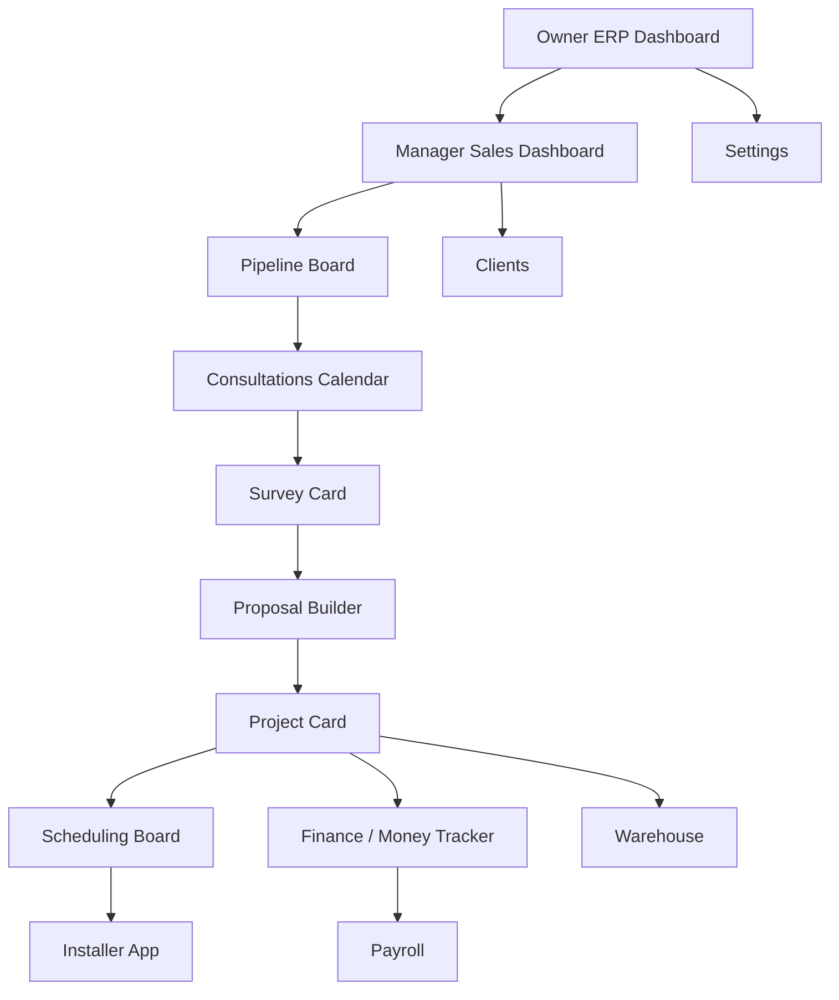

# ROLANPRO Screen Visuals

## Visual Thesis

- Mood: graphite operations room, warm daylight, glass, precision, dispatch energy
- Content plan: operating dashboards first, detail screens second, field workflow third
- Interaction thesis:
  - drag-and-drop is the primary motion on pipeline and scheduling screens
  - right-side inspectors slide in for record detail without losing list context
  - dashboards use live rails and status bands instead of heavy card grids

## Shared Shell

```text
┌──────────────────────────────────────────────────────────────────────────────────────────────────────┐
│ ROLANPRO                                    Поиск                                   Уведомления Профиль │
├────────────────┬────────────────────────────────────────────────────────────────────┬────────────────────┤
│ Навигация      │ Основное рабочее поле                                              │ Правая панель      │
│ Дашборд        │                                                                    │ события / alerts   │
│ Продажи        │                                                                    │ быстрые фильтры    │
│ Survey         │                                                                    │ quick actions      │
│ Proposal       │                                                                    │                    │
│ Проекты        │                                                                    │                    │
│ Календарь      │                                                                    │                    │
│ Диспетчер      │                                                                    │                    │
│ Финансы        │                                                                    │                    │
│ Склад          │                                                                    │                    │
│ Payroll        │                                                                    │                    │
│ Клиенты        │                                                                    │                    │
│ Настройки      │                                                                    │                    │
└────────────────┴────────────────────────────────────────────────────────────────────┴────────────────────┘
```

## Owner ERP Dashboard

```text
┌──────────────────────────────────────────────────────────────────────────────────────────────────────┐
│ OWNER ERP DASHBOARD                          Период: Март 2026                  Экспорт  Фильтры    │
├──────────────────────────────────────────────────────────────────────────────────────────────────────┤
│ ДЕНЬГИ СЕЙЧАС                                                                                      │
│ [Наличные 12 000] [Банк 68 500] [Stripe Pending 4 200] [Tax Reserve 9 600] [Доступно 18 300]     │
├──────────────────────────────────────────────────────────────────────────────────────────────────────┤
│ ЗА ПЕРИОД                              | ПРИБЫЛЬ                                                     │
│ Revenue This Month   74 200            | Gross Profit            41 400                              │
│ Payments Received    51 000            | Margin %                55.8%                               │
│ Outstanding Invoices 18 800            | Net Profit              22 100                              │
│ Expenses This Month  32 800            | Net Profit After OH     17 600                              │
│ Overhead This Month  12 100            | Payroll This Month      15 400                              │
├─────────────────────────────────────────┼────────────────────────────────────────────────────────────┤
│ ТОП ПРОЕКТЫ                            │ НИЗКАЯ МАРЖА                                                 │
│ PRJ-140  Profit 9 200  Margin 38%      │ PRJ-073  Margin 11%  Missing expenses                       │
│ PRJ-122  Profit 8 100  Margin 35%      │ PRJ-088  Margin 14%  Rework cost                            │
│ PRJ-101  Profit 7 400  Margin 33%      │ PRJ-097  Margin 16%  Material overuse                       │
├─────────────────────────────────────────┼────────────────────────────────────────────────────────────┤
│ ПО БРИГАДАМ                            │ KPI РОСТА                                                    │
│ Crew 1 Revenue 31k Profit 10.4k        │ Revenue / month                                              │
│ Crew 2 Revenue 24k Profit 7.9k         │ Gross profit / month                                         │
│ Crew 3 Revenue 19k Profit 5.3k         │ Net profit / month                                           │
│ Utilization 92 / 84 / 77 %             │ Revenue per crew / installer / avg job size / closing rate   │
└──────────────────────────────────────────────────────────────────────────────────────────────────────┘
```

## Manager Sales Dashboard

```text
┌──────────────────────────────────────────────────────────────────────────────────────────────────────┐
│ SALES DASHBOARD                             Менеджер: Alex R.                    Сегодня / Неделя    │
├──────────────────────────────────────────────────────────────────────────────────────────────────────┤
│ [Новые лиды 14] [Follow Ups Today 9] [Consultations Today 5] [Proposals Pending 8]                │
│ [Deposits Pending 4] [Waiting Schedule 6] [In Progress 11] [Final Payments Pending 3]             │
├──────────────────────────────────────────────────────────────────────────────────────────────────────┤
│ KPI МЕНЕДЖЕРА                                                                                      │
│ Leads 52   Calls 37   Consults Scheduled 18   Consults Completed 11   Proposals Sent 9             │
│ Deals Won 4  Deals Lost 2  Revenue 58k  Avg Deal 14.5k  Closing Rate 31%                           │
│ Lead→Consult 42%   Consult→Proposal 78%   Proposal→Deal 44%   Revenue / Manager 58k                │
├──────────────────────────────────────────────────────────────────────────────────────────────────────┤
│ СЕГОДНЯ                                  | ТРЕБУЕТ ВНИМАНИЯ                                           │
│ 09:00 Consultation - Hillside Residence  | Deposit overdue: D-192                                      │
│ 11:30 Proposal review - PR-442           | Proposal updated by client                                  │
│ 14:00 Follow-up call - Lead L-311        | Project waiting schedule                                    │
│ 16:00 Survey handoff                     | Final payment pending                                       │
├──────────────────────────────────────────┼────────────────────────────────────────────────────────────┤
│ БЫСТРЫЕ ДЕЙСТВИЯ                         │ LIVE RAIL                                                   │
│ [Создать лид] [Назначить consult]        │ client changed optional items                               │
│ [Отправить proposal] [Погонять deposit]  │ agreement signed                                            │
└──────────────────────────────────────────────────────────────────────────────────────────────────────┘
```

## Pipeline Board

```text
┌──────────────────────────────────────────────────────────────────────────────────────────────────────┐
│ PIPELINE BOARD                           Менеджер  Город  Источник  Сумма  Потерянные / Выигранные │
├───────────────┬───────────────┬───────────────┬───────────────┬───────────────┬────────────────────┤
│ New Lead      │ Contacted     │ Consult Sch.  │ Survey Done   │ Proposal Sent │ Deposit Pending    │
│ L-311         │ L-288         │ D-192         │ D-177         │ D-165         │ D-154              │
│ 8.4k          │ 12.1k         │ 18.2k         │ 21.4k         │ 16.0k         │ 22.8k              │
│ call needed   │ warm          │ Tue 10:00     │ smart scope   │ client review │ waiting payment    │
├───────────────┼───────────────┼───────────────┼───────────────┼───────────────┼────────────────────┤
│ Deposit Paid  │ Project Made  │ Scheduled     │ In Progress   │ Paid          │ Closed Won / Lost  │
│ D-143         │ PRJ-140       │ PRJ-122       │ PRJ-101       │ PRJ-088       │ CW 19 / CL 5       │
│ create job    │ add positions │ crew assign   │ active field  │ invoice paid  │ warranty lane      │
└──────────────────────────────────────────────────────────────────────────────────────────────────────┘
```

## Leads / Deals List

```text
┌──────────────────────────────────────────────────────────────────────────────────────────────────────┐
│ LEADS / DEALS                             Поиск   Stage   Owner   City   Source   Date             │
├──────────────────────────────────────────────────────────────────────────────────────────────────────┤
│ Lead ID | Client          | Phone      | Stage                  | Value  | Next action            │
│ L-311   | North Tower     | 555-01-22  | New Lead               | 8.4k   | call today             │
│ D-192   | Hillside Home   | 555-91-12  | Consultation Scheduled | 18.2k  | survey Tue 10:00       │
│ D-165   | Midtown Office  | 555-44-12  | Proposal Sent          | 16.0k  | waiting client         │
│ D-154   | Ocean Villa     | 555-22-45  | Deposit Pending        | 22.8k  | resend payment link    │
├──────────────────────────────────────────────────────────────────────────────────────────────────────┤
│ Правая панель: notes, follow ups, source, manager, client context, open survey / proposal / deal  │
└──────────────────────────────────────────────────────────────────────────────────────────────────────┘
```

## Consultations Calendar

```text
┌──────────────────────────────────────────────────────────────────────────────────────────────────────┐
│ CALENDAR ENGINE                         [День] [Неделя] [Месяц]     Role: Manager / Consultant     │
├──────────────────────────────────────────────────────────────────────────────────────────────────────┤
│ 08:00 | Consultation  | Survey        | Install        | Warranty / Service | Unassigned           │
│ 09:00 | L-311         | D-177         | PRJ-101        |                    | Consult no owner     │
│ 10:00 |               | Smart Survey  | PRJ-122        |                    | Re-measure pending   │
│ 11:00 | Callback      |               |                | Service Call       |                      │
│ 12:00 |               |               | Electrical V.  |                    |                      │
├──────────────────────────────────────────────────────────────────────────────────────────────────────┤
│ Event Inspector: type, track, address, assigned user, notes, client phone, drag to move, conflicts│
└──────────────────────────────────────────────────────────────────────────────────────────────────────┘
```

## Survey Card

```text
┌──────────────────────────────────────────────────────────────────────────────────────────────────────┐
│ SURVEY CARD                               D-192 Hillside Residence               Consultant: Mike    │
│ Client | Address | Менеджер notes | Smart / Solar / Safety flags                                   │
├──────────────────────────────────────────────────────────────────────────────────────────────────────┤
│ ROOMS / ZONES                                   | FILM RECOMMENDATION                                │
│ Room        Floor  Window  W     H     SQFT     | Category  Brand  Model  Thickness                 │
│ Office 1    2      W-01    60    80    33.3     | Smart Film / Gauzy / Vision Lite                  │
│ Lobby       1      W-02    72    90    45.0     | Solar / 3M / Prestige 70                          │
│ Conf Room   2      W-03    58    84    33.8     | Safety / LLumar / 8mil                            │
├─────────────────────────────────────────────────┼────────────────────────────────────────────────────┤
│ ATTRIBUTES                                      │ NOTES                                              │
│ glass_type / orientation / access / complexity  │ manager notes / consultant notes / electrical     │
│ photos per window                               │ recommendations                                     │
├─────────────────────────────────────────────────┼────────────────────────────────────────────────────┤
│ SURVEY PHOTOS                                   │ ACTIONS                                            │
│ glass / electrical / measurements / room shots  │ [Сохранить survey] [Сделать proposal inputs]      │
└──────────────────────────────────────────────────────────────────────────────────────────────────────┘
```

## Proposal Builder

```text
┌──────────────────────────────────────────────────────────────────────────────────────────────────────┐
│ PROPOSAL BUILDER                           PR-442 | Hillside Residence             Draft / Sent     │
├──────────────────────────────────────────────────────────────────────────────────────────────────────┤
│ SERVICE CARDS                                                                                       │
│ [1] Smart Film                                                                                      │
│ Category  Brand  Model     Qty/Sqft  Addons                    Base   Min    Actual   Line Total    │
│ Smart     Gauzy  Vision    80 sqft   washing, silicone         7200   6800   6900     6900          │
│------------------------------------------------------------------------------------------------------│
│ [2] Solar Film                                                                                      │
│ Solar     3M     Prestige  120 sqft  removal                   2600   2300   2400     2400          │
│------------------------------------------------------------------------------------------------------│
│ [3] Optional Items                                                                                   │
│ Washing 150  selected | Silicone 180 selected | Attachment 240 optional                             │
├──────────────────────────────────────────────────────────────────────────────────────────────────────┤
│ CLIENT VIEW PREVIEW                           | PROJECT SUMMARY                                      │
│ item select / remove / optional pick          | subtotal 9300                                        │
│ recalculated total live                       | discount -                                           │
│ agreement + sign CTA                          | total 9300                                           │
│                                               | below min? no                                        │
│                                               | approval required? no                                │
└──────────────────────────────────────────────────────────────────────────────────────────────────────┘
```

## Projects List

```text
┌──────────────────────────────────────────────────────────────────────────────────────────────────────┐
│ PROJECTS                                  Поиск   Статус   Приоритет   Город   Lead Installer      │
├──────────────────────────────────────────────────────────────────────────────────────────────────────┤
│ PRJ ID | Client | City     | Project Name      | Service Summary         | Complexity | Helpers | ! │
│ 101    | Acme   | LA       | Downtown Office   | Solar / Removal / Elec | 4          | 2       | N │
│ 088    | Nova   | Glendale | Beverly Residence | Smart Film / Silicone  | 3          | 1       | - │
│ 073    | Peak   | Pasadena | Retail Glass      | Safety / Removal       | 5          | 3       | ! │
├──────────────────────────────────────────────────────────────────────────────────────────────────────┤
│ Quick Preview: address, payment status, service count, margin warning, open project card            │
└──────────────────────────────────────────────────────────────────────────────────────────────────────┘
```

## Project Card

```text
┌──────────────────────────────────────────────────────────────────────────────────────────────────────┐
│ PRJ-101  Downtown Office        Ready   Deposit Paid   High Priority   Problem Flag: No            │
│ Address | Mar 24 | 09:00-13:00 | City LA | Zip 90017 | Complexity 4                                │
├──────────────────────────────────────────────┬───────────────────────────────────────────────────────┤
│ Tabs: Обзор | Позиции | График | Файлы       │ Inspector                                             │
│ Документы | Activity | Email | Финансы       │ Client / Payment / Priority / Notes                  │
├──────────────────────────────────────────────┼───────────────────────────────────────────────────────┤
│ ОБЗОР                                        │ CREW ASSIGNMENT                                       │
│ what to bring                                │ Lead Installer: Mike                                  │
│ manager notes                                │ Helper 1: Alex                                        │
│ installer notes                              │ Helper 2: Jon                                         │
│ finance snapshot read-only                   │ [Reassign Crew] [Send Notification]                   │
├──────────────────────────────────────────────────────────────────────────────────────────────────────┤
│ ПОЗИЦИИ ПРОЕКТА                                                                                     │
│ Smart Film   Gauzy Vision   80 sqft   zones 2 blocks 1   actual 6900   status Ready               │
│ Solar Film   3M Prestige    120 sqft  windows 8          actual 2400   status Scheduled           │
│ Removal      qty 12         extra 120                   actual 1200   status Pending               │
│ [Добавить услугу]                                                                                   │
├──────────────────────────────────────────────┬───────────────────────────────────────────────────────┤
│ ФАЙЛЫ                                        │ ДОКУМЕНТЫ                                             │
│ survey / before / after / issue / electrical │ contract / proposal / invoice / signed form           │
├──────────────────────────────────────────────┼───────────────────────────────────────────────────────┤
│ ACTIVITY LOG                                 │ PAYMENT + FINANCE                                     │
│ proposal approved                            │ Proposal Total / Deposit / Balance / Final Invoice    │
│ deposit paid                                 │ Gross Profit / Margin / Project Expenses              │
└──────────────────────────────────────────────────────────────────────────────────────────────────────┘
```

## Scheduling Board / Dispatch

```text
┌──────────────────────────────────────────────────────────────────────────────────────────────────────┐
│ DISPATCH BOARD                           [День] [Неделя]      Crew Filter      Installer Filter     │
├──────────────────────────────────────────────────────────────────────────────────────────────────────┤
│ Время     | Crew 1                               | Crew 2                               | Crew 3       │
│ 08:00     | PRJ-101 Install                      |                                      |              │
│           | Mike / Alex / Jon                    |                                      |              │
│ 10:00     |                                      | PRJ-122 Smart Install                |              │
│           |                                      | Sam / Leo                            |              │
│ 12:00     | PRJ-073 Problem Flag                 |                                      | PRJ-155      │
│           | materials missing                    |                                      | Warranty     │
├──────────────────────────────────────────────────────────────────────────────────────────────────────┤
│ Unassigned Lane: PRJ-120 no crew | PRJ-131 materials pending | PRJ-140 waiting installer          │
├──────────────────────────────────────────────────────────────────────────────────────────────────────┤
│ Conflict Engine: Mike overlap 09:00-13:00 | Crew 2 time conflict | Material reservation missing     │
└──────────────────────────────────────────────────────────────────────────────────────────────────────┘
```

## Finance / Money Tracker

```text
┌──────────────────────────────────────────────────────────────────────────────────────────────────────┐
│ FINANCE / MONEY TRACKER                    Период   Account   Project   Category   Status           │
├──────────────────────────────────────────────────────────────────────────────────────────────────────┤
│ ACCOUNTS                                                                                             │
│ Main Bank 68 500 | Stripe 4 200 pending | Cash 12 000 | Tax Reserve 9 600 | Owner Draw 0          │
├──────────────────────────────────────────────────────────────────────────────────────────────────────┤
│ MONEY MOVEMENTS                                                                                        │
│ Date     Type      Dir      Amount   Account     Project   Category        Status    Notes          │
│ Mar 03   deposit   income   5 000    Stripe      PRJ-101   project income  cleared   deposit paid   │
│ Mar 04   payroll   expense  1 820    Main Bank   PRJ-088   crew cost       paid      crew 2         │
│ Mar 05   rent      expense  2 400    Main Bank   -         overhead        cleared   storage         │
│ Mar 06   transfer  transfer 3 000    Main→Cash   -         internal        cleared   petty cash      │
├──────────────────────────────────────────────────────────────────────────────────────────────────────┤
│ PAYABLES                                     | COMPANY SUMMARY                                        │
│ Vendor / Due / Overdue / Paid               | revenue 74.2k  overhead 12.1k  payroll 15.4k         │
│ Glass Supply   due Mar 28   4 800           | gross profit 41.4k  net profit 22.1k                 │
│ Electric Sub   overdue      1 250           | cash available 18.3k                                 │
├──────────────────────────────────────────────┼───────────────────────────────────────────────────────┤
│ PROJECT FINANCIALS                          │ OUTSTANDING INVOICES                                  │
│ PRJ-101 revenue 11.2k margin 33%            │ PRJ-122 7 400                                         │
│ PRJ-122 revenue 18.9k margin 38%            │ PRJ-140 5 800                                         │
└──────────────────────────────────────────────────────────────────────────────────────────────────────┘
```

## Warehouse

```text
┌──────────────────────────────────────────────────────────────────────────────────────────────────────┐
│ WAREHOUSE                                 Поиск   Категория   Локация   Low Stock                   │
├──────────────────────────────────────────────────────────────────────────────────────────────────────┤
│ SKU     Item                    Unit   Qty On Hand   Reserved   Available   Location                 │
│ 3M-P70  3M Prestige 70          sqft   820           240        580         Rack A1                 │
│ GZ-VL   Gauzy Vision Lite       sqft   360           160        200         Rack B2                 │
│ SIL-01  Neutral Silicone        pcs    44            6          38          Bin C1                  │
├──────────────────────────────────────────────────────────────────────────────────────────────────────┤
│ RESERVATIONS                                 | MOVEMENTS                                             │
│ PRJ-101  3M Prestige 70   120 sqft           | purchase / reserve / consume / return / adjustment    │
│ PRJ-122  Gauzy Vision    80 sqft             | last move: consume 80 sqft for PRJ-122                │
├──────────────────────────────────────────────┼───────────────────────────────────────────────────────┤
│ Alerts: low stock / over-reserved / missing material / expected purchase                            │
└──────────────────────────────────────────────────────────────────────────────────────────────────────┘
```

## Payroll

```text
┌──────────────────────────────────────────────────────────────────────────────────────────────────────┐
│ PAYROLL                                    Период 1-15 Март                Release / Paid           │
├──────────────────────────────────────────────────────────────────────────────────────────────────────┤
│ Installer    Jobs  Sqft   Smart  Solar  Safety  Bonuses  Penalties  Final Payout  Status           │
│ Mike         11    820    2      5      1       220      -60        2 440         Released         │
│ Alex         9     640    1      4      2       0        -25        1 760         Draft            │
│ Sam          7     510    3      1      0       150      0          1 980         Paid             │
├──────────────────────────────────────────────────────────────────────────────────────────────────────┤
│ RULES                                      | ADJUSTMENTS                                            │
│ pay rule / split / minimum trip / cx mult  | bonus / penalty / manual override                      │
│ smart lead  x1.25                          | Mike +120 difficult access                             │
│ helper split 35%                           | Alex -25 late return                                   │
└──────────────────────────────────────────────────────────────────────────────────────────────────────┘
```

## Clients

```text
┌──────────────────────────────────────────────────────────────────────────────────────────────────────┐
│ CLIENTS                                  Поиск   Город   Статус   Last Project   Payment Health     │
├──────────────────────────────────────────────────────────────────────────────────────────────────────┤
│ Client | City | Phone | Email | Active Projects | Last Install | Payment Status | Notes             │
│ Acme   | LA   | 555.. | a@..  | 3               | Mar 24       | Deposit Paid   | VIP               │
│ Nova   | Gln  | 555.. | n@..  | 1               | Mar 24       | Pending        | HOA access        │
│ Peak   | Pas  | 555.. | p@..  | 2               | Mar 23       | Paid           | urgent response   │
├──────────────────────────────────────────────────────────────────────────────────────────────────────┤
│ Client Preview: billing address | service address | recent projects | open invoices | open issues   │
└──────────────────────────────────────────────────────────────────────────────────────────────────────┘
```

## Settings / Reference Tables

```text
┌──────────────────────────────────────────────────────────────────────────────────────────────────────┐
│ SETTINGS / REFERENCE TABLES                   Resource: service_types / pay_rules / price_book      │
├───────────────────────┬──────────────────────────────────────────────────────────────────────────────┤
│ Resources             │ Editable Table                                                        Preview │
│ service_types         │ service_name | code | unit | active                                       │
│ service_field_config  │ field_key    | label | input | dropdown_source                            │
│ service_addons        │ addon_name   | code  | unit  | price                                       │
│ film_catalog          │ category     | brand | model | thickness                                   │
│ statuses              │ status_name  | code  | color | active                                      │
│ event_types           │ ...                                                                    │
│ price_book            │ service / film / base / min / unit                                         │
│ pay_rules             │ service / role / rate / cx mult / split                                    │
│ split_rules           │ service / lead % / helper %                                                │
│ minimum_trip_rules    │ service / amount                                                           │
│ email_templates       │ template / subject / preview                                               │
└───────────────────────┴──────────────────────────────────────────────────────────────────────────────┘
```

## Installer App

```text
┌──────────────────────────────────────────────────────────────────────────────────────────────────────┐
│ Tabs: График | Мои Jobs | Фото | Checklist | Completion | Earnings | Stats | Alerts | Chat         │
├──────────────────────────────────────────────────────────────────────────────────────────────────────┤
│ TODAY SCHEDULE                                                                                      │
│ 09:00  PRJ-101 Downtown Office       Ready                                                          │
│ 11:00  PRJ-088 Beverly Residence     On the way                                                     │
│ 14:00  PRJ-073 Retail Smart Film     Problem reported                                               │
├──────────────────────────────────────────────────────────────────────────────────────────────────────┤
│ JOB DETAIL                                                                                            │
│ Project: PRJ-101                                                                                      │
│ Full Address: 1250 S Hope St, Los Angeles, CA 90017                                                  │
│ Client Phone: (555) 201-1102                                                                         │
│ [Navigate]                                                                                            │
├──────────────────────────────────────────────────────────────────────────────────────────────────────┤
│ Assigned Positions: Solar Film / Removal / Silicone                                                  │
│ What To Bring: ladder, sealant, control kit                                                          │
│ Manager Notes: use loading bay entrance                                                               │
│ Survey Photos: glass / electrical / room shots                                                       │
├──────────────────────────────────────────────────────────────────────────────────────────────────────┤
│ Time Tracking                               | Requirements                                           │
│ on_the_way_at 08:21                         | Before Photos  Required                               │
│ started_at    09:03                         | After Photos   Required                               │
│ paused_at     --                            | Checklist      pending                                │
│ completed_at  --                            | Completion Form pending                               │
├──────────────────────────────────────────────────────────────────────────────────────────────────────┤
│ Earnings Today 320 | Week 1 240 | Month 3 860 | Bonuses 120 | Penalties -25 | Final Payout 3 955  │
│ Stats: jobs 26 | sqft 5 420 | smart 7 | solar 13 | safety 4 | blocks 6 | zones 11 | rate 94%      │
├──────────────────────────────────────────────────────────────────────────────────────────────────────┤
│ [On the way] [Start] [Pause] [Resume] [Complete] [Report Problem] [Open Chat]                       │
└──────────────────────────────────────────────────────────────────────────────────────────────────────┘
```

## Mobile Installer App

```text
┌──────────────────────────────┐
│ ROLANPRO Installer           │
│ Graph  Jobs  Pay  Stats      │
│ Alerts Chat                  │
├──────────────────────────────┤
│ Сегодня 09:00                │
│ PRJ-101 Downtown Office      │
│ Ready                        │
├──────────────────────────────┤
│ Адрес                        │
│ 1250 S Hope St, LA 90017     │
│ Клиент                       │
│ (555) 201-1102               │
│ [Навигатор]                  │
├──────────────────────────────┤
│ Позиции                      │
│ Smart Film                   │
│ Removal                      │
├──────────────────────────────┤
│ Взять с собой                │
│ ladder, sealant              │
│ Notes менеджера              │
│ loading bay entrance         │
├──────────────────────────────┤
│ Выехал    08:21              │
│ Начал     09:03              │
│ Пауза     --                 │
│ Завершил  --                 │
├──────────────────────────────┤
│ До / После / Checklist       │
│ required / required / open   │
├──────────────────────────────┤
│ Заработок                    │
│ Today 320  Week 1240         │
│ Month 3860                   │
├──────────────────────────────┤
│ [Выехал] [Старт]             │
│ [Пауза]  [Готово]            │
│ [Проблема] [Чат]             │
└──────────────────────────────┘
```

## Navigation Map


