# ROLANPRO Settings / Reference Tables

## Purpose

The `Settings / Reference Tables` module stores controlled values used across the system so the application does not depend on free-text statuses, categories, or templates.

Design rule:

- Main business tables should store reference IDs.
- The API should resolve those IDs into labels, colors, and metadata for the UI.
- Most reference tables should support `active`, `sort_order`, `created_at`, and `updated_at`.
- Service-specific forms must be driven by configuration tables, not hardcoded field layouts.
- Internal CRM / ERP / Installer App screens must use Russian reference labels.
- Client-facing proposals, agreements, invoices, completion forms, warranty documents, and emails must use English reference labels.
- Reference-driven labels must not be hardcoded in UI, PDF, or email templates.

## Access Model

- `Manager`: view and edit
- `Owner`: view
- `Installer`: no direct access

## Reference Tables

### `service_types`

Fields:

- `service_type_id`
- `name_ru`
- `name_en`
- `service_code`
- `unit_type`
- `default_complexity_level_id`
- `default_checklist_template_id`
- `active`
- `sort_order`
- `created_at`
- `updated_at`

Relationships:

- `project_positions.service_type_id -> service_types.service_type_id`
- `checklist_templates.applies_to_service_type_id -> service_types.service_type_id`
- `service_field_config.service_type_id -> service_types.service_type_id`
- `service_addons.service_type_id -> service_types.service_type_id`

### `service_field_config`

Fields:

- `service_field_config_id`
- `service_type_id`
- `field_key`
- `field_label`
- `input_type`
- `data_type`
- `dropdown_source`
- `is_required`
- `default_value`
- `sort_order`
- `active`
- `created_at`
- `updated_at`

Relationships:

- `service_field_config.service_type_id -> service_types.service_type_id`

Notes:

- This table tells the UI which fields to show after the manager selects a service type.
- `dropdown_source` can point to `film_catalog`, `employees`, `complexity_levels`, status tables, or other controlled references.

### `service_addons`

Fields:

- `service_addon_id`
- `service_type_id`
- `name_ru`
- `name_en`
- `addon_code`
- `unit_type`
- `default_price`
- `active`
- `sort_order`
- `created_at`
- `updated_at`

Relationships:

- `service_addons.service_type_id -> service_types.service_type_id`
- `project_position_addons.service_addon_id -> service_addons.service_addon_id`

Notes:

- Addons must be filtered by the selected `service_type`.
- New addons should be addable later without rebuilding the position form.

### `film_catalog`

Fields:

- `film_id`
- `category_code`
- `category_name_ru`
- `category_name_en`
- `brand_code`
- `brand_name_ru`
- `brand_name_en`
- `model_code`
- `model_name_ru`
- `model_name_en`
- `unit`
- `active`
- `sort_order`
- `created_at`
- `updated_at`

Relationships:

- `project_positions.film_id -> film_catalog.film_id`
- `warehouse_items.film_id -> film_catalog.film_id` if stock records are film-linked
- can serve as a dropdown source for `service_field_config.dropdown_source`

### `employees`

Fields:

- `employee_id`
- `employee_code`
- `name`
- `role_id`
- `crew_id`
- `phone`
- `email`
- `active`
- `created_at`
- `updated_at`

Relationships:

- `projects.manager_id -> employees.employee_id`
- `projects.lead_installer_id -> employees.employee_id`
- `schedules.lead_installer_id -> employees.employee_id`
- `schedule_assignments.employee_id -> employees.employee_id`
- `position_installers.employee_id -> employees.employee_id`
- `installer_jobs.installer_id -> employees.employee_id`
- `attachments_files.uploaded_by -> employees.employee_id`
- `activity_log.user_id -> employees.employee_id`
- `email_actions.created_by -> employees.employee_id`
- `payroll.employee_id -> employees.employee_id`
- serves as a dropdown source for lead installer and helper selection

### `roles`

Fields:

- `role_id`
- `role_name`
- `role_code`
- `description`
- `active`
- `sort_order`
- `created_at`
- `updated_at`

Relationships:

- `employees.role_id -> roles.role_id`
- `user_access.role_id -> roles.role_id`

### `crews`

Fields:

- `crew_id`
- `crew_name`
- `lead_employee_id`
- `active`
- `sort_order`
- `created_at`
- `updated_at`

Relationships:

- `employees.crew_id -> crews.crew_id`
- `schedule` grouping can be derived from assigned employees and crew membership

### `project_statuses`

Fields:

- `project_status_id`
- `name_ru`
- `name_en`
- `status_code`
- `color_token`
- `is_closed`
- `active`
- `sort_order`
- `created_at`
- `updated_at`

Relationships:

- `projects.project_status_id -> project_statuses.project_status_id`

### `position_statuses`

Fields:

- `position_status_id`
- `status_name`
- `status_code`
- `color_token`
- `is_closed`
- `active`
- `sort_order`
- `created_at`
- `updated_at`

Relationships:

- `project_positions.position_status_id -> position_statuses.position_status_id`
- serves as a dropdown source for dynamic position forms

### `payment_statuses`

Fields:

- `payment_status_id`
- `status_name`
- `status_code`
- `color_token`
- `is_closed`
- `active`
- `sort_order`
- `created_at`
- `updated_at`

Relationships:

- `projects.payment_status_id -> payment_statuses.payment_status_id`
- `finance.payment_status_id -> payment_statuses.payment_status_id`

### `schedule_statuses`

Fields:

- `schedule_status_id`
- `status_name`
- `status_code`
- `color_token`
- `is_closed`
- `active`
- `sort_order`
- `created_at`
- `updated_at`

Relationships:

- `schedules.schedule_status_id -> schedule_statuses.schedule_status_id`

### `complexity_levels`

Fields:

- `complexity_level_id`
- `level_name`
- `level_code`
- `numeric_rank`
- `color_token`
- `active`
- `sort_order`
- `created_at`
- `updated_at`

Relationships:

- `projects.complexity_level_id -> complexity_levels.complexity_level_id`
- `project_positions.complexity_level_id -> complexity_levels.complexity_level_id`
- `service_types.default_complexity_level_id -> complexity_levels.complexity_level_id`
- serves as a dropdown source for dynamic position forms

### `event_types`

Fields:

- `event_type_id`
- `name_ru`
- `name_en`
- `event_code`
- `color_token`
- `active`
- `sort_order`
- `created_at`
- `updated_at`

Relationships:

- `calendar_events.event_type_id -> event_types.event_type_id`
- `schedule.event_type_id -> event_types.event_type_id`

### `cities`

Fields:

- `city_id`
- `city_name`
- `state_code`
- `default_zip_code`
- `service_area`
- `active`
- `sort_order`
- `created_at`
- `updated_at`

Relationships:

- `clients.city_id -> cities.city_id`
- `projects.city_id -> cities.city_id`

### `warehouse_items`

Fields:

- `warehouse_item_id`
- `sku`
- `item_name_ru`
- `item_name_en`
- `category_name_ru`
- `category_name_en`
- `brand`
- `model`
- `unit`
- `reorder_level`
- `active`
- `created_at`
- `updated_at`

Relationships:

- `project_positions.warehouse_item_id -> warehouse_items.warehouse_item_id`
- `warehouse_movements.warehouse_item_id -> warehouse_items.warehouse_item_id`

### `notification_types`

Fields:

- `notification_type_id`
- `type_name`
- `type_code`
- `default_channel`
- `active`
- `sort_order`
- `created_at`
- `updated_at`

Relationships:

- `notifications.notification_type_id -> notification_types.notification_type_id`

### `expense_categories`

Fields:

- `category_id`
- `name_ru`
- `name_en`
- `parent_type`
- `parent_category_id`
- `active`
- `sort_order`
- `created_at`
- `updated_at`

Relationships:

- `money_movements.category_id -> expense_categories.category_id`
- `money_movements.subcategory_id -> expense_categories.category_id`
- `payables.category_id -> expense_categories.category_id`
- used by finance ledger classification for both project-linked and overhead expenses

Notes:

- `parent_type` must distinguish `project` or `overhead`.
- `parent_category_id` supports nested subcategories for ledger reporting.

### `document_types`

Fields:

- `document_type_id`
- `name_ru`
- `name_en`
- `document_code`
- `requires_signature`
- `active`
- `sort_order`
- `created_at`
- `updated_at`

Relationships:

- `documents.document_type_id -> document_types.document_type_id`

### `email_templates`

Fields:

- `email_template_id`
- `template_key`
- `template_name`
- `subject_template`
- `body_template`
- `active`
- `sort_order`
- `created_at`
- `updated_at`

Relationships:

- `email_actions.email_template_id -> email_templates.email_template_id`

Notes:

- Client-facing email templates should be authored in English because client emails are sent in English.

### `price_book_items`

Fields:

- `price_book_item_id`
- `name_ru`
- `name_en`
- `service_type_id`
- `film_id`
- `base_price`
- `min_price`
- `unit_type`
- `active`
- `sort_order`
- `created_at`
- `updated_at`

Relationships:

- used by proposal and project pricing
- `project_position_pricing.price_book_item_id -> price_book_items.price_book_item_id`

Notes:

- If a single-table `price_book` implementation is used, each sellable row should still expose the same bilingual fields as `price_book_items`.

### `pay_rules`

Fields:

- `pay_rule_id`
- `service_type_id`
- `role_type`
- `rate`
- `complexity_multiplier`
- `minimum_trip`
- `split_mode`
- `active`
- `sort_order`
- `created_at`
- `updated_at`

Relationships:

- used by payroll calculation engine

### `split_rules`

Fields:

- `split_rule_id`
- `service_type_id`
- `lead_percent`
- `helper_percent`
- `active`
- `sort_order`
- `created_at`
- `updated_at`

Relationships:

- used by payroll lead/helper split logic

### `minimum_trip_rules`

Fields:

- `minimum_trip_rule_id`
- `service_type_id`
- `amount`
- `active`
- `sort_order`
- `created_at`
- `updated_at`

Relationships:

- used by payroll minimum trip logic

### `checklist_templates`

Fields:

- `checklist_template_id`
- `template_name`
- `applies_to_service_type_id`
- `items_json`
- `active`
- `sort_order`
- `created_at`
- `updated_at`

Relationships:

- `service_types.default_checklist_template_id -> checklist_templates.checklist_template_id`
- `installer_jobs.checklist_template_id -> checklist_templates.checklist_template_id`

### `problem_types`

Fields:

- `problem_type_id`
- `problem_name`
- `problem_code`
- `severity`
- `active`
- `sort_order`
- `created_at`
- `updated_at`

Relationships:

- `projects.problem_type_id -> problem_types.problem_type_id` when `problem_flag = true`
- `installer_jobs.problem_type_id -> problem_types.problem_type_id` when `problem_reported = true`

## Recommended Main-Table FK Mapping

### `projects`

Recommended FK-backed fields:

- `project_status_id`
- `payment_status_id`
- `city_id`
- `complexity_level_id`
- `lead_installer_id`
- `problem_type_id` nullable

### `project_positions`

Recommended FK-backed fields:

- `service_type_id`
- `film_id`
- `position_status_id`
- `complexity_level_id`
- `warehouse_item_id`

### `project_position_addons`

Recommended FK-backed fields:

- `position_id`
- `service_addon_id`

### `employees`

Recommended FK-backed fields:

- `role_id`
- `crew_id`

### `schedules`

Recommended FK-backed fields:

- `schedule_status_id`
- `lead_installer_id`

### `notifications`

Recommended FK-backed fields:

- `notification_type_id`

### `documents`

Recommended FK-backed fields:

- `document_type_id`

### `email_actions`

Recommended FK-backed fields:

- `email_template_id`

### `installer_jobs`

Recommended FK-backed fields:

- `checklist_template_id`
- `problem_type_id` nullable

## Relationship Summary

```mermaid
erDiagram
    ROLES ||--o{ EMPLOYEES : assigns
    CREWS ||--o{ EMPLOYEES : groups
    CITIES ||--o{ CLIENTS : locates
    CITIES ||--o{ PROJECTS : locates
    PROJECT_STATUSES ||--o{ PROJECTS : labels
    PAYMENT_STATUSES ||--o{ PROJECTS : labels
    COMPLEXITY_LEVELS ||--o{ PROJECTS : grades
    SERVICE_TYPES ||--o{ PROJECT_POSITIONS : defines
    SERVICE_TYPES ||--o{ SERVICE_FIELD_CONFIG : configures
    SERVICE_TYPES ||--o{ SERVICE_ADDONS : enables
    FILM_CATALOG ||--o{ PROJECT_POSITIONS : catalogs
    SERVICE_ADDONS ||--o{ PROJECT_POSITION_ADDONS : selected
    PROJECT_POSITIONS ||--o{ PROJECT_POSITION_ADDONS : contains
    POSITION_STATUSES ||--o{ PROJECT_POSITIONS : labels
    COMPLEXITY_LEVELS ||--o{ PROJECT_POSITIONS : grades
    WAREHOUSE_ITEMS ||--o{ PROJECT_POSITIONS : supplies
    SCHEDULE_STATUSES ||--o{ SCHEDULES : labels
    NOTIFICATION_TYPES ||--o{ NOTIFICATIONS : categorizes
    DOCUMENT_TYPES ||--o{ DOCUMENTS : categorizes
    EMAIL_TEMPLATES ||--o{ EMAIL_ACTIONS : powers
    CHECKLIST_TEMPLATES ||--o{ INSTALLER_JOBS : powers
    PROBLEM_TYPES ||--o{ PROJECTS : classifies
    PROBLEM_TYPES ||--o{ INSTALLER_JOBS : classifies
```

